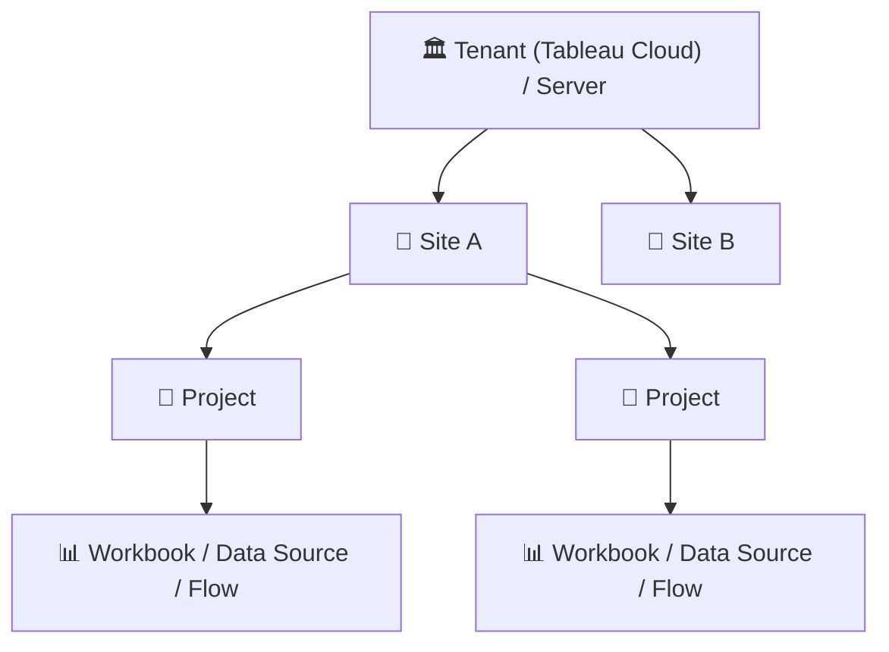
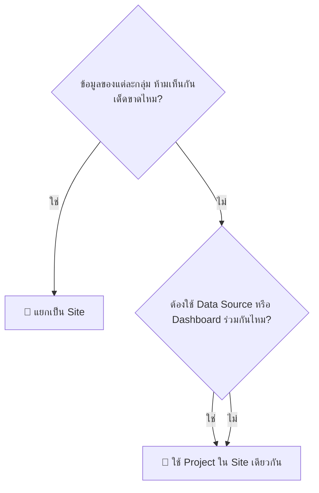
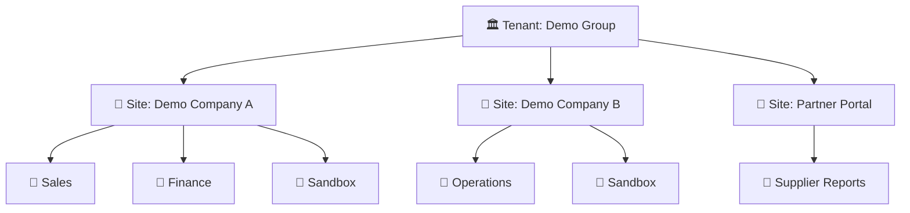

# 🏢 Tableau Site คืออะไร: ข้อดี ข้อเสีย และการประยุกต์ใช้งาน

> ทำความเข้าใจ **Site** บน Tableau Cloud และ Tableau Server ว่าคืออะไร แยกอะไรออกจากกันบ้าง ข้อดี ข้อเสีย และเมื่อไรควรใช้ **Site** หรือ **Project**

> [!IMPORTANT]
> **อัปเดตล่าสุด: 9 ตุลาคม 2026** เนื้อหาอ้างอิงจากเอกสารทางการของ **Tableau** โดยมีลิงก์อ้างอิงกำกับไว้ใต้แต่ละหัวข้อ

---

## 🧭 สารบัญ

| | หัวข้อ |
|:---:|---|
| 1️⃣ | [Site คืออะไร](#1️⃣-site-คืออะไร) |
| 2️⃣ | [โครงสร้างลำดับชั้น](#2️⃣-โครงสร้างลำดับชั้น) |
| 3️⃣ | [อะไรแยก อะไรใช้ร่วมกัน](#3️⃣-อะไรแยก-อะไรใช้ร่วมกัน) |
| 4️⃣ | [จำนวน Site และ Storage บน Tableau Cloud](#4️⃣-จำนวน-site-และ-storage-บน-tableau-cloud) |
| 5️⃣ | [ข้อดี](#5️⃣-ข้อดี) |
| 6️⃣ | [ข้อเสีย](#6️⃣-ข้อเสีย) |
| 7️⃣ | [Site หรือ Project ใช้อะไรดี](#7️⃣-site-หรือ-project-ใช้อะไรดี) |
| 8️⃣ | [ตัวอย่างการประยุกต์ใช้งาน](#8️⃣-ตัวอย่างการประยุกต์ใช้งาน) |
| ❓ | [คำถามที่พบบ่อย](#-คำถามที่พบบ่อย) |
| 📚 | [แหล่งอ้างอิง](#-แหล่งอ้างอิง) |

---

## 1️⃣ Site คืออะไร

**Site** คือพื้นที่ที่มี **User, Group และ Content เป็นของตัวเอง** แยกขาดจาก Site อื่นบน Tableau Server หรือ Tableau Cloud เดียวกัน แต่ละ Site มี **URL ของตัวเอง**

> [!NOTE]
> Tableau เรียกแนวคิดนี้ว่า **Multi-tenancy** คือหลายกลุ่มผู้ใช้อยู่บนระบบเดียวกันแต่ถูก "กั้นกำแพง" แยกจากกัน
> 🏬 **เปรียบง่าย ๆ:** Tableau เหมือน **อาคารสำนักงาน** · Site คือ **ชั้นแต่ละชั้น** ที่ล็อกประตูแยกกัน · Project คือ **ห้องในชั้นนั้น**

📎 อ้างอิง: [Sites Overview](https://help.tableau.com/current/server/en-us/sites_intro.htm)

---

## 2️⃣ โครงสร้างลำดับชั้น

| ระดับ | ใครดูแล | หน้าที่ |
|---|---|---|
| 🏛️ **Tenant** *(Tableau Cloud)* | Cloud Admin ผ่าน **Tableau Cloud Manager** | สร้าง/แก้ Site, จัดการ User ระดับองค์กร, ดูการใช้ License ข้ามหลาย Site |
| 🏢 **Site** | Site Administrator | จัดการ Content, User และสิทธิ์ภายใน Site ภายใต้ข้อกำหนดของ Tenant |
| 📁 **Project** | Project Leader / Owner | จัดกลุ่ม Content และกำหนดสิทธิ์ภายใน Site |

> [!TIP]
> บน **Tableau Server** ผู้สร้าง Site ได้คือ **Server Administrator** เท่านั้น ส่วนบน **Tableau Cloud** สร้าง Site ผ่าน **Tableau Cloud Manager**

📎 อ้างอิง: [Use Tableau Cloud Manager](https://help.tableau.com/current/online/en-gb/cloud_manager_intro.htm) · [Sites Overview](https://help.tableau.com/current/server/en-us/sites_intro.htm)

---

## 3️⃣ อะไรแยก อะไรใช้ร่วมกัน

| 🔒 แยกกันในแต่ละ Site | 🔗 ใช้ร่วมกันทุก Site *(Tableau Server)* |
|---|---|
| User และ Group | โครงสร้างพื้นฐานของ Server และ Run As Account |
| Project, Workbook, Data Source | Authentication Type (กำหนดตอนติดตั้ง) |
| Site Role และ Permission | Credential ของผู้ใช้ (Login ครั้งเดียว แล้วเลือก Site) |
| ตารางเวลา Extract Refresh | License (1 License ต่อ User ไม่ว่าอยู่กี่ Site) |
| Site Administrator | Server Administrator (เข้าถึงได้ทุก Site) |

📎 อ้างอิง: [Sites Overview](https://help.tableau.com/current/server/en-us/sites_intro.htm)

---

## 4️⃣ จำนวน Site และ Storage บน Tableau Cloud

| Edition | จำนวน Site สูงสุด |
|---|:---:|
| 🟢 Standard | 3 |
| 🔵 Enterprise | 10 |
| 🟣 Cloud+ | 50 |
| 🟠 Tableau+ Bundle | 50 |

📎 อ้างอิง: [Tableau Cloud Pricing](https://www.tableau.com/pricing/cloud)

| Storage ต่อ Site | เงื่อนไข |
|---|---|
| **1 TB** | ค่าเริ่มต้น |
| **5 TB** | Enterprise, Tableau+ หรือ Site ที่มี Advanced Management |

📎 อ้างอิง: [Tableau Cloud Site Capacity](https://help.tableau.com/current/online/en-us/cloud_manager_capacity_site.htm)

---

## 5️⃣ ข้อดี

| | ข้อดี | รายละเอียด |
|:---:|---|---|
| 🔒 | **แยกข้อมูลเด็ดขาด** | Content แต่ละ Site แยกขาดจากกัน User ของ Site หนึ่งมองไม่เห็นข้อมูลของอีก Site |
| 👥 | **แยกการบริหาร** | แต่ละ Site มี Site Admin, Site Role, Permission และตาราง Extract Refresh ของตัวเอง |
| 🌐 | **URL แยก** | ทำเป็น Portal เฉพาะให้แต่ละกลุ่มผู้ใช้ได้ |
| 🎫 | **ไม่ต้องซื้อ License ซ้ำ** | ผู้ใช้ 1 คนเข้าได้หลาย Site โดยไม่ต้องมี License แยกต่อ Site (รายละเอียดดู [คำถามที่พบบ่อย](#-คำถามที่พบบ่อย)) |
| 🔑 | **Login ครั้งเดียว** | ใช้ Credential เดียวกัน แล้วเลือก Site ตอน Sign in |
| 🏛️ | **บริหารรวมศูนย์** *(Tableau Cloud)* | Cloud Admin ดูแลทุก Site และ License ได้จาก Tableau Cloud Manager ที่เดียว |

📎 อ้างอิง: [Sites Overview](https://help.tableau.com/current/server/en-us/sites_intro.htm) · [Use Tableau Cloud Manager](https://help.tableau.com/current/online/en-gb/cloud_manager_intro.htm) · [What is Tableau Cloud Manager?](https://www.tableau.com/blog/what-is-tableau-cloud-manager)

---

## 6️⃣ ข้อเสีย

| | ข้อเสีย | รายละเอียด |
|:---:|---|---|
| 🚫 | **แชร์ Content ข้าม Site ไม่ได้** | ถ้าหลาย Site ใช้ข้อมูลเดียวกัน ต้อง Publish Data Source/รายงานซ้ำในแต่ละ Site ทำให้ Data Source กระจัดกระจายและอาจกระทบประสิทธิภาพ |
| 🔁 | **งาน Admin ซ้ำซ้อน** | การตั้งค่าหลายอย่างต้องทำซ้ำทุก Site |
| 📦 | **ย้ายข้าม Site ยาก** | การย้าย User และ Content จาก Site หนึ่งไปอีก Site เป็นงานที่ใช้แรงมาก |
| ⚙️ | **บางค่าตั้งแยกไม่ได้** *(Tableau Server)* | Authentication Type และ Run As Account ใช้ร่วมกันทั้ง Server |
| 📏 | **จำนวนจำกัดตาม Edition** *(Tableau Cloud)* | Standard สร้างได้สูงสุด 3 Site |

> [!WARNING]
> ก่อนแยกเป็นหลาย Site ให้ถามตัวเองก่อนว่า **"ผู้ใช้จำเป็นต้องเห็นข้อมูลข้ามกันไหม?"** ถ้าใช่ การแยก Site จะทำให้ทำงานยากขึ้น

📎 อ้างอิง: [Sites Overview](https://help.tableau.com/current/server/en-us/sites_intro.htm) · [Tableau Cloud Pricing](https://www.tableau.com/pricing/cloud)

---

## 7️⃣ Site หรือ Project ใช้อะไรดี

| | 🏢 ใช้ Site | 📁 ใช้ Project |
|---|---|---|
| **ระดับการแยก** | แยกขาด: User, Content, สิทธิ์ | แยกเป็นหมวดหมู่ คุมด้วย Permission |
| **แชร์ Data Source ร่วมกัน** | ❌ | ✅ |
| **ภาระงาน Admin** | สูง (ทำซ้ำทุก Site) | ต่ำ |
| **เหมาะกับ** | Multi-tenancy จริง ข้อมูลห้ามปนกัน | แยกแผนก, แยก Dev / Test / Production |

> [!TIP]
> **หลักจำง่าย ๆ:** ข้อมูล **"ห้ามเห็นกันเด็ดขาด"** ให้แยก **Site** ถ้าแค่ **"อยากจัดหมวดหมู่และคุมสิทธิ์"** ให้ใช้ **Project**

📎 อ้างอิง: [Sites Overview](https://help.tableau.com/current/server/en-us/sites_intro.htm)

---

## 8️⃣ ตัวอย่างการประยุกต์ใช้งาน

### ✔️ เหมาะกับการแยก Site

| | สถานการณ์ | ตัวอย่าง |
|:---:|---|---|
| 🏢 | หลายบริษัทในเครือที่ข้อมูลห้ามปนกัน | **กลุ่มบริษัทตัวอย่าง** แยก 1 Site ต่อ 1 บริษัทลูก |
| 🤝 | Consultant หรือผู้ให้บริการที่ดูแลลูกค้าหลายราย | 1 Site ต่อลูกค้า 1 ราย ข้อมูลลูกค้าไม่ปะปนกัน |
| 👤 | ให้ Guest หรือ User ภายนอกเข้าถึงพื้นที่จำกัด | Portal ให้ **Supplier ตัวอย่าง** ดูเฉพาะรายงานของตัวเอง |

### ✔️ เหมาะกับการใช้ Project แทน

| | สถานการณ์ | เหตุผล |
|:---:|---|---|
| 🧪 | แยก Sandbox / Dev / Production | Tableau แนะนำให้ใช้ Project เพราะการแยก Site เพิ่มภาระดูแล |
| 🏬 | แยกตามแผนก (Sales, Finance, HR) ในองค์กรเดียว | ผู้ใช้มักต้องดูข้อมูลข้ามแผนก ถ้าแยก Site จะแชร์กันไม่ได้ |
| 📊 | ใช้ Published Data Source กลางร่วมกัน | Project ใน Site เดียวกันใช้ Data Source ร่วมกันได้ |

### 🗺️ ตัวอย่างการวางโครงสร้าง

> [!NOTE]
> ชื่อบริษัทในตัวอย่างเป็น **ชื่อสมมติ** ใช้เพื่ออธิบายแนวคิดเท่านั้น

📎 อ้างอิง: [Sites Overview](https://help.tableau.com/current/server/en-us/sites_intro.htm)

---

## ❓ คำถามที่พบบ่อย

**Q: User หนึ่งคนอยู่หลาย Site ได้ไหม?**
A: ได้ ใช้ Credential เดียวกันแล้วเลือก Site ตอน Sign in

**Q: ย้าย Workbook จาก Site หนึ่งไปอีก Site ได้ไหม?**
A: แชร์ข้าม Site โดยตรงไม่ได้ ต้อง Publish ซ้ำ และ Tableau ระบุว่าการย้าย User และ Content ข้าม Site เป็นงานที่ใช้แรงมาก

**Q: แยก Dev / Production ควรใช้ Site ไหม?**
A: Tableau แนะนำให้ใช้ **Project** สำหรับ Workflow แบบ Sandbox ไป Production เพราะการแยก Site เพิ่มภาระดูแล

**Q: Tableau Cloud Standard มีได้กี่ Site?**
A: สูงสุด 3 Site (Enterprise 10, Cloud+ และ Tableau+ Bundle 50)

**Q: User 1 คนที่อยู่หลาย Site ต้องใช้ License กี่ตัว?**
A: **ใช้ 1 License ไม่ต้องซื้อแยกตาม Site** ทั้งบน Tableau Server และ Tableau Cloud แต่รายละเอียดที่ Tableau ระบุไว้ต่างกันเล็กน้อย

| | 🖥️ Tableau Server | ☁️ Tableau Cloud (Tableau Cloud Manager) |
|---|---|---|
| **จำนวน License** | 1 License ต่อ User ไม่ว่าอยู่กี่ Site | ให้ User เข้าหลาย Site ได้ **โดยไม่ต้องมี License แยกสำหรับแต่ละ Site** |
| **ประเภท License ที่ใช้** | ตาม **Site Role สูงสุด** ที่ User มีบน Server | Tableau ไม่ได้ระบุกฎนี้ไว้ในเอกสาร Tableau Cloud Manager |
| **การควบคุม** | Server Administrator | Cloud Admin จัดการ License รวมที่ระดับ Tenant และกำหนด **Site Role Limits** เพื่อจำกัดจำนวน License ที่แต่ละ Site ใช้ได้ |

> [!NOTE]
> - Cloud Admin ที่ไม่มี Site Role ใน Site ใด **ไม่ใช้ License** ของ Tableau Cloud
> - บน Tableau Cloud ถ้า License ใน Tenant ไม่พอ User ที่เกินจะถูกตั้งเป็น **Unlicensed** ใน Site นั้น ต้องปรับ Site Role Limits ข้าม Site เพื่อให้ได้ License

📎 อ้างอิง: [Sites Overview](https://help.tableau.com/current/server/en-us/sites_intro.htm) · [What is Tableau Cloud Manager? (Tableau Blog)](https://www.tableau.com/blog/what-is-tableau-cloud-manager) · [Cloud Administrator Role and Tasks](https://help.tableau.com/current/online/en-us/cloud_manager_admin.htm) · [Add, Rename, Delete, or Activate Sites](https://help.tableau.com/current/online/en-us/cloud_manager_sites.htm) · [Tableau Cloud Pricing](https://www.tableau.com/pricing/cloud)

---

## 📚 แหล่งอ้างอิง

ตรวจสอบเมื่อ **9 ตุลาคม 2026**

| แหล่ง | เนื้อหา |
|---|---|
| [Sites Overview – Tableau Server](https://help.tableau.com/current/server/en-us/sites_intro.htm) | Site คืออะไร, สิ่งที่แยก/ใช้ร่วม, Site หรือ Project, ข้อควรระวัง |
| [Use Tableau Cloud Manager](https://help.tableau.com/current/online/en-gb/cloud_manager_intro.htm) | Tenant, Tableau Cloud Manager, บทบาท Cloud Admin |
| [What is Tableau Cloud Manager? (Tableau Blog)](https://www.tableau.com/blog/what-is-tableau-cloud-manager) | User เข้าหลาย Site โดยไม่ต้องมี License แยกต่อ Site |
| [Cloud Administrator Role and Tasks](https://help.tableau.com/current/online/en-us/cloud_manager_admin.htm) | Cloud Admin, Site Role Limits, การใช้ License |
| [Add, Rename, Delete, or Activate Sites](https://help.tableau.com/current/online/en-us/cloud_manager_sites.htm) | การจัดการ Site และ License เมื่อ Activate Site |
| [Tableau Cloud Pricing](https://www.tableau.com/pricing/cloud) | จำนวน Site ตาม Edition |
| [Tableau Cloud Site Capacity](https://help.tableau.com/current/online/en-us/cloud_manager_capacity_site.htm) | Storage ต่อ Site |

---

[⬆️ กลับไปด้านบน](#-tableau-site-คืออะไร-ข้อดี-ข้อเสีย-และการประยุกต์ใช้งาน)

**Created by The Narit Lab**
